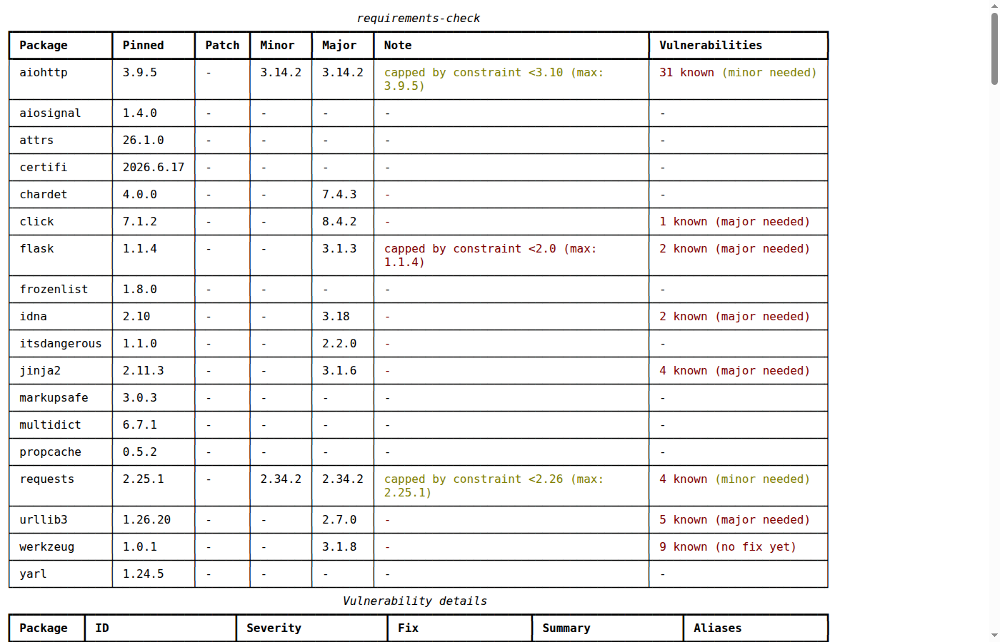

<h1 align="center">requirements-check</h1>

<p align="center">
  <strong>Check requirements.txt for outdated dependencies and known vulnerabilities.</strong>
</p>

<p align="center">
  <a href="https://pypi.org/project/requirements-check"></a>
  <a href="https://pypi.org/project/requirements-check"></a>
  <a href="https://github.com/manfred-kaiser/requirements-check/blob/main/LICENSE"></a>
</p>

---

`requirements-check` scans a `requirements.txt` file and reports, per dependency, the best available patch, minor, and major update, and whether the pinned version has known vulnerabilities — directly from the [PyPI JSON API](https://warehouse.pypa.io/api-reference/json.html) and [OSV.dev](https://osv.dev), in parallel via `httpx`/`asyncio`, with nothing installed.

Most tools cover only one half of this. `pip-check`-style tools show outdated versions but nothing about vulnerabilities, and need the packages installed. `pip-audit`/Safety show vulnerabilities but not update size. Dependabot does both, but only as a GitHub platform service (PRs), not a CLI you can run anywhere. `requirements-check` combines both **and** goes one step further: for every known vulnerability, it tells you whether a low-risk **patch** already fixes it or whether you're forced into a **minor**/**major** bump — from one command, against a plain `requirements.txt`. It also exports the same data as a [CycloneDX SBOM](#sbom-software-bill-of-materials) or [self-contained HTML report](#html-report), and is built to run unattended in [CI pipelines](#ci-integration).

## Quick Start

```sh
pip install requirements-check
```

```sh
requirements-check
```

Scans `./requirements.txt` by default and prints a table with the pinned version, the latest available patch/minor/major update, notes for exceptional cases, and known vulnerabilities (including whether a patch already fixes them, or a bigger bump is required):

```
                               requirements-check
┏━━━━━━━━━━━━━┳━━━━━━━━━┳━━━━━━━━━┳━━━━━━━━┳━━━━━━━━┳━━━━━━┳━━━━━━━━━━━━━━━━┓
┃ Package     ┃ Pinned  ┃ Patch   ┃ Minor  ┃ Major  ┃ Note ┃ Vulnerabiliti… ┃
┡━━━━━━━━━━━━━╇━━━━━━━━━╇━━━━━━━━━╇━━━━━━━━╇━━━━━━━━╇━━━━━━╇━━━━━━━━━━━━━━━━┩
│ aiohttp     │ 3.11.11 │ 3.11.18 │ 3.14.2 │ 3.14.2 │ -    │ 30 known       │
│             │         │         │        │        │      │ (minor needed) │
├─────────────┼─────────┼─────────┼────────┼────────┼──────┼────────────────┤
│ cryptograp… │ 44.0.0  │ 44.0.3  │ 44.0.3 │ 49.0.0 │ -    │ 7 known (major │
│             │         │         │        │        │      │ needed)        │
├─────────────┼─────────┼─────────┼────────┼────────┼──────┼────────────────┤
│ Jinja2      │ 3.1.5   │ 3.1.6   │ 3.1.6  │ 3.1.6  │ -    │ 2 known (patch │
│             │         │         │        │        │      │ fixes)         │
├─────────────┼─────────┼─────────┼────────┼────────┼──────┼────────────────┤
│ alembic     │ 1.18.4  │ 1.18.5  │ 1.18.5 │ 1.18.5 │ -    │ -              │
└─────────────┴─────────┴─────────┴────────┴────────┴──────┴────────────────┘
```

The `Note` column only shows exceptional cases (`unpinned`, `unsupported`, `not found`, or a constraint capping an update — see [How it works](#how-it-works)) — for normal dependencies the Patch/Minor/Major columns already say everything there is to say about available updates, so it stays empty.

Add `--list-vulnerabilities` to see each vulnerability individually (ID, severity, which update level fixes it, summary, CVE/PYSEC aliases) instead of just a count:

```sh
requirements-check --list-vulnerabilities
```

## CLI

```sh
requirements-check [FILE] [OPTIONS]
```

`FILE` — path to the `requirements.txt` file to check (default: `requirements.txt` in the current directory).

| Option                      | Description                                                                          |
| ---------------------------- | ------------------------------------------------------------------------------------- |
| `--json`                     | Machine-readable JSON output instead of a table                                       |
| `--sbom`                     | CycloneDX 1.6 JSON SBOM instead of a table                                            |
| `--html`                     | Self-contained HTML report instead of a table                                         |
| `--list-vulnerabilities`     | List each known vulnerability individually instead of just a count                    |
| `--no-security`               | Skip the OSV.dev vulnerability check                                                  |
| `--no-transitive-check`        | Skip warning about dependencies declared by your pinned packages that aren't listed in this file |
| `--constraints PATH`          | Loose, unresolved requirements file (e.g. a pip-compile `.in` source) to cross-check suggestions against; auto-detected as `FILE` with a `.in` extension if not given |
| `--fail-on-vulnerability`     | Exit with status 1 if a known vulnerability is found (for CI)                         |
| `--python-version VERSION`    | Target Python version (e.g. `3.11`) for `requires-python` compatibility filtering; defaults to the running interpreter |
| `--proxy URL`                 | HTTP(S) proxy for PyPI/OSV requests (overrides `HTTP_PROXY`/`HTTPS_PROXY` env vars)   |
| `--ca-bundle PATH`            | Custom CA bundle file, e.g. for corporate TLS-intercepting proxies                    |
| `--no-color`                  | Disable colored/styled table output (also honors the `NO_COLOR` env var)              |
| `--output PATH`, `-o PATH`    | Write the report to this file instead of stdout (works with the table, `--json`, `--sbom`, and `--html`) |

`--json`, `--sbom`, and `--html` are mutually exclusive — pick one output format.

Exit codes: `0` success, `1` vulnerabilities found (only with `--fail-on-vulnerability`), `2` usage error (e.g. file not found).

```sh
# JSON output for a specific file
requirements-check requirements/prod.txt --json

# CycloneDX SBOM
requirements-check --sbom --output sbom.json

# Self-contained HTML report
requirements-check --html --output report.html

# CI usage: fail the build on known vulnerabilities
requirements-check --fail-on-vulnerability

# Behind a corporate TLS-intercepting proxy
requirements-check --proxy http://proxy.example.com:3128 --ca-bundle /etc/ssl/ca-bundle.pem

# Cross-check against an explicit pip-compile source (auto-detected if named requirements.in)
requirements-check requirements.txt --constraints requirements.in
```

## SBOM (Software Bill of Materials)

```sh
requirements-check --sbom --output sbom.json
```

Produces a [CycloneDX](https://cyclonedx.org) 1.6 JSON SBOM (validated against the official schema), built entirely from data `requirements-check` already collects — no extra network calls:

- **Components**: one per pinned dependency, with a [PURL](https://github.com/package-url/purl-spec) (`pkg:pypi/name@version`) and, when available, a license
- **Vulnerabilities**: every known vulnerability, with `affects` pointing at the exact component, plus its CVE/PYSEC aliases and OSV severity/fixed-version as CycloneDX `properties`

```json
{
  "bomFormat": "CycloneDX",
  "specVersion": "1.6",
  "components": [
    {
      "type": "library",
      "bom-ref": "pkg:pypi/jinja2@3.1.5",
      "purl": "pkg:pypi/jinja2@3.1.5",
      "name": "Jinja2",
      "version": "3.1.5",
      "licenses": [{ "license": { "name": "BSD-3-Clause" } }]
    }
  ],
  "vulnerabilities": [
    {
      "id": "GHSA-cpwx-vrp4-4pq7",
      "source": { "name": "OSV", "url": "https://osv.dev/vulnerability/GHSA-cpwx-vrp4-4pq7" },
      "description": "Jinja2 vulnerable to sandbox breakout through attr filter selecting format method",
      "affects": [{ "ref": "pkg:pypi/jinja2@3.1.5" }],
      "references": [{ "id": "CVE-2025-27516", "source": { "name": "OSV" } }],
      "properties": [
        { "name": "requirements-check:osv_severity", "value": "CVSS:4.0/AV:N/AC:L/..." },
        { "name": "requirements-check:fixed_version", "value": "3.1.6" }
      ]
    }
  ]
}
```

Only dependencies with a pinned version become components — an SBOM describes a concrete build, so unpinned or unresolvable entries are excluded. As with the update/vulnerability checks, coverage depends on `requirements.txt` being fully resolved (see [How it works](#how-it-works)).

An SBOM is typically most useful uploaded to a tracking system like [OWASP Dependency-Track](https://dependencytrack.org/), which continuously re-scans stored SBOMs against new vulnerability feeds — so you find out about a newly disclosed CVE in a dependency you shipped months ago, without re-running a build. Only CycloneDX JSON is supported (not SPDX or XML) — see [CI Integration](#ci-integration) below for an upload example.

Full example: [`examples/sample-sbom.json`](examples/sample-sbom.json), generated from [`examples/requirements.txt`](examples/requirements.txt) (see [How it works](#how-it-works) for how that file was produced).

## HTML Report

```sh
requirements-check --html --output report.html
```

Renders the same table(s) as the terminal output (plus the vulnerability details table with `--list-vulnerabilities`) as a single self-contained HTML file — inline CSS, no external assets, safe to email or drop on a file share for people who don't use a terminal.

<p align="center">
  
</p>

Full example: [`examples/sample-report.html`](examples/sample-report.html) — download it (or clone the repo) and open it locally; GitHub's file viewer shows HTML as source rather than rendering it. It was generated from [`examples/requirements.txt`](examples/requirements.txt) via:

```sh
requirements-check examples/requirements.txt --html --output examples/sample-report.html --list-vulnerabilities
```

A plain, non-HTML JSON equivalent is at [`examples/sample-report.json`](examples/sample-report.json) for comparison.

## CI Integration

`requirements-check` is designed to run unattended: no prompts, stable exit codes, `--no-color` to keep log output free of ANSI codes, and `--output` to write a report straight to a file (no shell redirection required).

```yaml
# .github/workflows/requirements-check.yml
name: requirements-check

on:
  pull_request:
  schedule:
    - cron: "0 6 * * 1"  # weekly

jobs:
  check:
    runs-on: ubuntu-latest
    steps:
      - uses: actions/checkout@v4
      - uses: actions/setup-python@v5
        with:
          python-version: "3.13"
      - run: pip install requirements-check

      # Human-readable summary in the log
      - run: requirements-check --no-color

      # Machine-readable report as a workflow artifact
      - run: requirements-check --json --output requirements-check.json
      - uses: actions/upload-artifact@v4
        with:
          name: requirements-check-report
          path: requirements-check.json

      # SBOM as a workflow artifact (and optionally push to Dependency-Track)
      - run: requirements-check --sbom --output sbom.json
      - uses: actions/upload-artifact@v4
        with:
          name: sbom
          path: sbom.json
      # - run: |
      #     curl -X POST "$DTRACK_URL/api/v1/bom" \
      #       -H "X-Api-Key: $DTRACK_API_KEY" \
      #       -F "project=$DTRACK_PROJECT_UUID" \
      #       -F "bom=@sbom.json"

      # Fail the build on known vulnerabilities
      - run: requirements-check --fail-on-vulnerability
```

For scripts, agents, or any other automated caller: use `--json` rather than parsing the table — the table's formatting isn't a stable interface, the JSON schema is. Each dependency has `name`, `pinned_version`, `latest_patch`/`latest_minor`/`latest_major`, `update_level`, `vulnerabilities` (with `id`, `summary`, `severity`, `aliases`, `fixed_version`, `fix_level`), `minimum_safe_version`, `vulnerability_fix_level`, and `error`.

## How it works

### Update levels

For each pinned dependency, `requirements-check` fetches all non-yanked, non-prerelease versions from PyPI, filters out versions whose `requires-python` doesn't match the target Python version, and then reports the best version available at each level:

- **Patch**: highest version within the same major.minor as the pinned version
- **Minor**: highest version within the same major as the pinned version
- **Major**: highest version overall

The `update_level` field (not shown as its own table column — it's already implied by which of Patch/Minor/Major differs from Pinned) reflects the size of the jump to the highest available version; it's used for `--json` output and for `Note` in the table when no ordinary patch/minor/major applies (`unpinned`/`unsupported`/`not_found`).

Version parsing and comparison uses [`packaging.version.Version`](https://packaging.pypa.io/en/stable/version.html) — the same reference [PEP 440](https://peps.python.org/pep-0440/) implementation pip itself uses — so it's not limited to plain `major.minor.patch`:

- **Any number of release segments**: CalVer-style versions like `2024.11.06` or short ones like `23.1` work the same way; missing segments are treated as `0`
- **Epochs** (`1!2.0`) are compared and displayed correctly
- **Post-releases** (`1.0.0.post1`) count as an available patch, same as a normal patch bump
- **Pre-releases and dev-releases** (alpha/beta/rc/dev) are never suggested — only stable releases are considered

### Vulnerabilities

Every dependency with a pinned version is queried against [OSV.dev](https://osv.dev) in a single batched request (`POST /v1/querybatch`), matching the exact pinned version — not the latest one. Matching vulnerability IDs are then resolved to their summary and severity via `GET /v1/vulns/{id}`, run in parallel. OSV.dev aggregates GitHub Security Advisories, the PyPA Advisory DB, and other sources; no API key required.

For each vulnerability, the OSV record's affected-version range is used to find the lowest version that actually resolves it (`fixed_version`), which is then classified the same way as updates: does a **patch** already fix it, or is a **minor**/**major** bump required? If OSV lists no fix yet, it's flagged `no_fix`. A dependency's `vulnerability_fix_level` is the worst of all its vulnerabilities' fix levels — e.g. if one CVE is patch-fixable but another needs a major bump, the dependency shows `major`, since that's what's needed to be fully clean. This lets you tell at a glance whether you can resolve a CVE with a low-risk patch bump or are forced into a bigger jump.

### Direct, transitive, and constrained dependencies

`requirements-check` only looks at what's actually written in the given file — it does not resolve dependencies itself.

**Coverage.** If your `requirements.txt` lists only direct dependencies, only those get checked; anything they pull in transitively stays invisible to it. For full coverage, use a fully resolved file — e.g. generated with [pip-compile](https://pip-tools.readthedocs.io/) (from [pip-tools](https://github.com/jazzband/pip-tools)) or `uv pip compile`, which pin every direct *and* transitive dependency with exact versions. Point `requirements-check` at that file (not your loose `requirements.in`/`pyproject.toml`) and every installed package gets checked and included in the SBOM.

To help catch it when you forget: `requirements-check` fetches each pinned package's own declared dependencies (`requires_dist` from PyPI) and warns if any aren't listed in your file at all — a strong signal it isn't fully resolved:

```
⚠ 3 dependencies declared by your pinned packages aren't listed in this file: certifi, idna, urllib3
  This requirements.txt may not be fully resolved — consider generating it with pip-compile or a similar tool.
```

Disable with `--no-transitive-check`. This is a heuristic based on declared metadata, not a real resolver — it can miss or over-flag edge cases (optional/platform-specific dependencies in particular).

**Constraints.** If you *do* use pip-compile, its `.in` source has your actual version ceilings (e.g. `flask<2.0`), while the compiled `requirements.txt` only has the single resolved pin. `requirements-check` cross-checks against that `.in` file when present — auto-detected next to your requirements file (same name, `.in` extension), or given explicitly via `--constraints PATH`. If the true latest release on PyPI is blocked by your own constraint, the `Note` column says so instead of just suggesting an update `pip-compile --upgrade` can't actually deliver until you edit `requirements.in` yourself:

```
Note: capped by constraint <2.0 (max: 1.1.4)
```

All example files in this repo follow that pattern: [`examples/requirements.in`](examples/requirements.in) has 3 range-constrained direct dependencies (`flask<2.0`, `requests<2.26`, `aiohttp<3.10`), and [`examples/requirements.txt`](examples/requirements.txt) is its `pip-compile` output — 18 packages, direct and transitive. The constraints deliberately cap old, vulnerable versions so the example actually has outdated packages, known vulnerabilities, and constraint-capped updates to show off — they're not a recommendation to use these versions or ranges.

## Network access

`requirements-check` only talks to two hosts, both read-only (`GET`/`POST`, no credentials sent):

| Host                | Endpoint(s)                                                              | Purpose                                                   |
| -------------------- | -------------------------------------------------------------------------- | ------------------------------------------------------------ |
| `pypi.org`            | `GET /pypi/{package}/json`                                                 | Version list per dependency                                |
| `pypi.org`            | `GET /pypi/{package}/{pinned_version}/json`                                | License and declared dependencies for the *pinned* version (only when a version is pinned — see below) |
| `api.osv.dev`         | `POST /v1/querybatch`, `GET /v1/vulns/{id}`                                 | Vulnerability lookup and details                            |

Two GET requests per pinned dependency to `pypi.org` (not one): PyPI's unversioned endpoint always reflects the *latest* release, so a second, version-specific request is needed to get accurate license and dependency metadata for what's actually pinned — otherwise an old pin could be reported against its latest release's metadata. Both the `license` field and the transitive-dependency check are read from that same second request, so `--no-transitive-check` skips the *comparison*, not the request itself. All requests run concurrently and are batched where the API allows it (OSV.dev). Use `--no-security` to skip `api.osv.dev` entirely. Use `--proxy`/`--ca-bundle` (or the standard `HTTP_PROXY`/`HTTPS_PROXY`/`SSL_CERT_FILE` env vars) to route all of this through a corporate proxy.

## Limitations

- Only `requirements.txt`-format files are currently supported (pip's plain `name==version` / PEP 508 format) — not `pyproject.toml`, `Pipfile`/`Pipfile.lock`, `poetry.lock`, or `uv.lock` directly. Export or compile those to a `requirements.txt` first (e.g. `poetry export`, `uv export --format requirements-txt`).
- VCS and direct URL requirements (`git+https://...`, `name @ https://...`) can't be version-checked and are reported as `unsupported`.
- The transitive-dependency warning and constraint cross-check are heuristics based on declared PyPI metadata, not a real dependency resolver — they can miss or over-flag edge cases (see [How it works](#how-it-works)).
- SBOM export is CycloneDX JSON only — no SPDX, no XML (see [SBOM](#sbom-software-bill-of-materials)).
- The PyPI host is hardcoded to `pypi.org` — there's currently no way to point it at an internal mirror (Artifactory, Nexus, devpi). Whether that would even work depends on the mirror: most only implement the [Simple Repository API](https://peps.python.org/pep-0503/) (`/simple/{name}/`, enough for `pip install`), not the richer PyPI JSON API (`/pypi/{name}/json`) this tool relies on for `requires_dist`, license, and per-release `requires_python` — even a mirror that proxies the full upstream may or may not pass that through, depending on its configuration.
- There's no offline mode for the OSV.dev vulnerability check — it requires live internet access to `api.osv.dev`. In fully air-gapped environments, `--no-security` is the only current option (skips vulnerability checking entirely). OSV.dev does publish downloadable per-ecosystem data dumps (e.g. `https://osv-vulnerabilities.storage.googleapis.com/PyPI/all.zip`) that could support a future offline mode, but that isn't implemented yet.

## License

[MIT](LICENSE)
